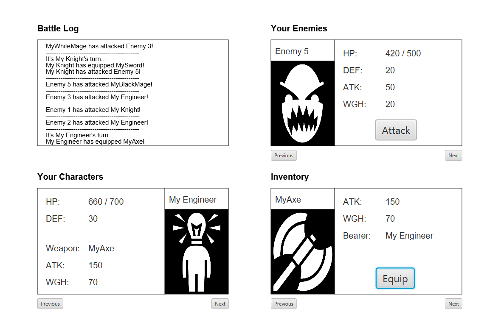

Final Reality
=============

This work is licensed under a 
[Creative Commons Attribution 4.0 International License](http://creativecommons.org/licenses/by/4.0/)

Context
-------

This project's goal is to create a (simplified) clone of _Final Fantasy_'s combat, a game developed
by [_Square Enix_](https://www.square-enix.com).
Broadly speaking, for the combat the player has a group of characters to control and a group of 
enemies controlled by the computer. The code is written in Java and built using the MVC design pattern.

Version Notes: v1.05
----------------------------

Choose 5 characters and 5 weapons to fight against 5 CPU-controlled enemies!
On each character's turn, you'll choose a weapon to equip, and an enemy to attack.
Each character can equip weapons according to its class, and the weapon class.

Each character has a name, class, HP and defense. The classes are the following:

- Knight
- Engineer
- Thief
- White Mage
- Black Mage

On each character's turn, it can equip a weapon. The weapons classes are:

- Sword
- Axe
- Knife
- Bow
- Staff

Each weapon has a name, weight and attack damage, and those stats are inherited by the character holding it.
Enemies can't equip weapons, they have their own fixed attack damage and weight.

 - Knights can equip Swords, Axes and Knives.
 - Engineers can equip Axes and Bows.
 - Thieves can equip Swords, Staffs and Bows.
 - Black Mages can equip Knives and Staffs.
 - White Mages can equip only Staffs.

The order of the turns is decided according to the weight.
Each class will have different stats!

Damage is calculated as the attack damage of the attacker, minus the defense of the victim.
If a character or enemy goes down to 0 HP, it is out of combat.
The team (characters or enemies) that has all its characters out of combat will lose the game.

Choose your team wisely! Good luck!

Mid-Battle screenshot
----------------------------

Future releases
----------------------------

Future releases include the addition of a battle timer, randomization of enemies' stats and names, and the ability
for mages to cast spells while holding a staff. Be sure to check out!